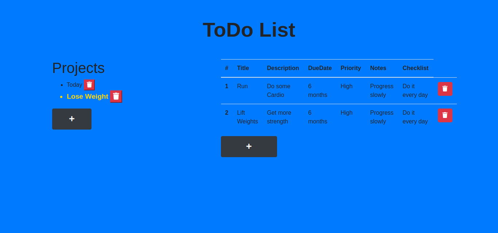

# Project Todo List - Javascript

This is a simple website where you can keep track of the tasks you need to do. You can group the tasks by a Project.

### Screenshots

### Main Page

### ToDo Item Form(valid)

### ToDo Item Form(invalid)

### Edit ToDo List Items

### Datetime option

### FEATURES

You can register lists of tasks to do, and each list can have many tasks. You can change the details of the tasks by clicking on the attribute you want to change. Beyond that, you can delete tasks and projects.

### BUILT WITH

- HTML
- CSS
- Javascript
- Bootstrap

### LIVE VERSION

- [GitHack](https://raw.githack.com/expjazz/toDOList/featureV1/dist/index.html)

### SETUP

- `git@github.com:expjazz/toDOList.git`
- `run npm install on the root folder`
- `open the index.html on the dist folder inside the root`
- `To open in the development mode, type npm start on the terminal`

### AUTHORS

👤 Marios Kanellopoulos

- Github: [@mariosknl](https://github.com/mariosknl)
- Twitter: [@mariosknl](https://twitter.com/MariosKnl)
- Linkedln: [marios-kanellopoulos](https://www.linkedin.com/in/marios-kanellopoulos)
- Portfolio: [marios-kanellopoulos](https://marioskanellopoulos.com/)

👤Expedito Andrade

- Github: [@githubexpjazz](https://github.com/expjazz)
- Twitter: [@expjazz](https://twitter.com/expeditoandrade13)
- Linkedin: [Expedito Andrade](https://www.linkedin.com/in/expedito-andrade/)
- Portfolio: [Expedito Andrade](https://expjazz.github.io/expedito_andrade/)

### Show your support

Give a star if you like this project!

### Acknowledgments

- Microverse

### 🤝 Contributing

Contributions, issues, and feature requests are welcome!
Feel free to check the issues page.

### Show your support

Give a ⭐️ if you like this project!

### 📝 License

This project is MIT licensed
